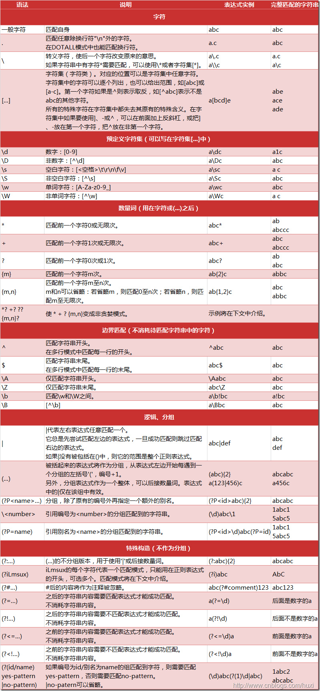

Python正则表达式学习
====================

>摘要

- 在正则表达式中，如果直接给出字符，就是精确匹配。
- {m,n}? 对于前一个字符重复 m 到 n 次，并且取尽可能少的情况 在字符串'aaaaaa'中，a{2,4} 会匹配 4 个 a，但 a{2,4}? 只匹配 2 个 a。
- ^表示行的开头，^\d表示必须以数字开头。
- $表示行的结束，\d$表示必须以数字结束。

你可能注意到了，py也可以匹配'python'–>py;
但是加上^py$就变成了整行匹配，就只能匹配’py’了,匹配'python'时，就什么也得不到。


## 参考表

### 正则表达式特殊序列

| *特殊表达式* | *意义* |
| ------ | ----------- |
| \A    | 只在字符串开头进行匹配 |
| \b    | 匹配位于开头或者结尾的空字符串 |
| \B    | 匹配不位于开头或者结尾的空字符串 |
| \d    | 匹配任意十进制数，相当于[0-9] |
| \D    | 匹配任意非数字字符，相当于[\^0-9] |
| \s    | 匹配任意空白字符，相当于[\t\n\r\f\v] |
| \S    | 匹配任意非空白字符，相当于[\^\t\n\r\f\v] |
| \w    | 匹配任意数字和字母，相当于[a-zA-Z0-9_] |
| \W    | 匹配任意非数字和字母的字符，相当于[\^a-zA-Z0-9_] |
| \Z    | 只在字符串结尾进行匹配 |


### re模块

>re.compile(pattern[, flags])

把正则表达式的模式和标识转化成正则表达式对象，供 match() 和 search() 这两个函数使用。

*re 所定义的 flag 包括：*

```python
re.I 忽略大小写
re.L 表示特殊字符集 '\w, \W, \b, \B, \s, \S 依赖于当前环境'
re.M 多行模式
re.S 即为'.'并且包括换行符在内的任意字符（'.'不包括换行符）
re.U 表示特殊字符集 '\w, \W, \b, \B, \d, \D, \s, \S 依赖于 Unicode 字符属性数据库'
re.X 为了增加可读性，忽略空格和’ # ’后面的注释
```

以下两种用法结果相同：

```python
# (A)
compiled_pattern = re.compile(pattern) 
result = compiled_pattern.match(string)

# (B)
result = re.match(pattern, string)
```

```python
s = 'ABC\\-001' # Python的字符串
 #对应的正则表达式字符串变成：
 #'ABC\-001'
```

因此我们强烈建议使用Python的r前缀，就不用考虑转义的问题了

```python
s = r'ABC\-001' # Python的字符串
# 对应的正则表达式字符串不变：
# 'ABC\-001'
```


### search

>re.search(pattern, string[, flags])

**在字符串中查找匹配正则表达式模式的位置**，返回 MatchObject的实例，如果没有找到匹配的位置，则返回 None。

对于已编译的正则表达式对象来说（re.RegexObject），有以下 search 的方法：

search (string[, pos[, endpos]])

若 regex 是已编译好的正则表达式对象，regex.search(string, 0, 50) 等同于 regex.search(string[:50], 0)。

```python
 >>> pattern = re.compile("a") 
 >>> pattern.search("abcde")     # Match at index 0 
 >>> pattern.search("abcde", 1)  # No match;
```

### match

>re.match(pattern, string[, flags])

判断 pattern 是否在字符串**开头位置**匹配。对于 RegexObject，有：

>match(string[, pos[, endpos]])

match() 函数只在字符串的开始位置尝试匹配正则表达式，也就是只报告从位置 0 开始的匹配情况，而 search() 函数是扫描整个字符串来查找匹配。**如果想要搜索整个字符串来寻找匹配，应当用 search()**

```python
>>> pattern.match('bca',2).group()
'a'
```

虽然，match默认是从开头匹配，但是，如果指定位置，仍然能成功；但是！match也是从指定位置开始匹配，不匹配仍然会失败，这一点就和search有区别啦。

match()方法判断是否匹配，如果匹配成功，返回一个Match对象，否则返回None。

```python
test = '用户输入的字符串'
if re.match(r'正则表达式', test):
    print('ok')
else:
    print('failed')
```

### split

>re.split(pattern, string[, maxsplit=0, flags=0])

此功能很常用，可以将将字符串匹配正则表达式的部分割开并返回一个列表。对 RegexObject，有函数：

>split(string[, maxsplit=0])

**对于一个找不到匹配的字符串而言，split 不会对其作出分割**

```python
>>> 'a b   c'.split(' ')
['a', 'b', '', '', 'c']
```

这里用字符串自带的split方法就很不灵活。

```python
>>> re.split(r'\s+', 'a b   c')
['a', 'b', 'c']
```

看出差别了吧，很强大！再来一个终极的：

```python
>>> re.split(r'[\s\,\;]+', 'a,b;; c  d')
['a', 'b', 'c', 'd']
```

r'[\s\,\;]+'的正则表达式意思为：空格或者,或者;出现1次或1次以上都是满足条件的分割符号！所以，最后结果还是很干净。

### findall

>re.findall(pattern, string[, flags])

在字符串中找到正则表达式所匹配的所有子串，并组成一个列表返回。同样 RegexObject有：

>findall(string[, pos[, endpos]])

```python
 #get all content enclosed with [], and return a list 
>>> pattern=re.compile(r'hh')
>>> pattern.findall('hhmichaelhh')
['hh', 'hh']
```

### finditer

>re.finditer(pattern, string[, flags])

和 findall 类似，在字符串中找到正则表达式所匹配的所有子串，并组成一个迭代器返回。同样 RegexObject 有：

>finditer(string[, pos[, endpos]])

### sub

>re.sub(pattern, repl, string[, count, flags])

在字符串 string 中找到匹配正则表达式pattern 的所有子串，用另一个字符串 repl 进行替换。如果没有找到匹配 pattern 的串，则返回未被修改的 string。Repl 既可以是字符串也可以是一个函数。

返回值是替换后的新字符串。

对于 RegexObject 有：

>sub(repl, string[, count=0])

```python
>>> pattern=re.compile(r'\d')
>>> pattern.sub('no','12hh34hh')
'nonohhnonohh'
>>> pattern.sub('no','12hh34hh',0)
'nonohhnonohh'
>>> pattern.sub('no','12hh34hh',count=0)
'nonohhnonohh'
>>> pattern.sub('no','12hh34hh',1)
'no2hh34hh'
```

通过上面的例子，可以看出,count是可以缺省的，同时，默认值是0，表示全部替换；否则，就是指定替换几个。

### subn

>re.subn(pattern, repl, string[, count, flags])

该函数的功能和sub()相同，但它还返回新的字符串以及替换的次数。同样RegexObject有：

>subn(repl, string[, count=0])

```python
>>> pattern.subn('no','12hh34hh',count=0)
('nonohhnonohh', 4)
```

### 分组

除了简单地判断是否匹配之外，正则表达式还有提取子串的强大功能。用()表示的就是要提取的分组（Group）。比如：

^(\d{3})-(\d{3,8})$分别定义了两个组，可以直接从匹配的字符串中提取出区号和本地号码：

```python
>>> m = re.match(r'^(\d{3})-(\d{3,8})$', '010-12345')
>>> m
<_sre.SRE_Match object; span=(0, 9), match='010-12345'>
>>> m.group(0)
'010-12345'
>>> m.group(1)
'010'
>>> m.group(2)
'12345'
>>> m.groups()
('010', '12345')
```

通过实验，如果不用括号，得到的Match对象课可以使用例如a.group(0)或者a.group()但是，使用a.group(1)就会报错的。

### 贪婪匹配

正则匹配默认是贪婪匹配，也就是匹配尽可能多的字符。举例如下，匹配出数字后面的0：

```python
>>> re.match(r'^(\d+)(0*)$', '102300').groups()
('102300', '')
```

由于\d+采用贪婪匹配，直接把后面的0全部匹配了，结果0*只能匹配空字符串了。

必须让\d+采用非贪婪匹配（也就是尽可能少匹配），才能把后面的0匹配出来，加个?就可以让d+采用非贪婪匹配：

```python
>>> re.match(r'^(\d+?)(0*)$', '102300').groups()
('1023', '00')
```


## Python正则表达式学习资源

